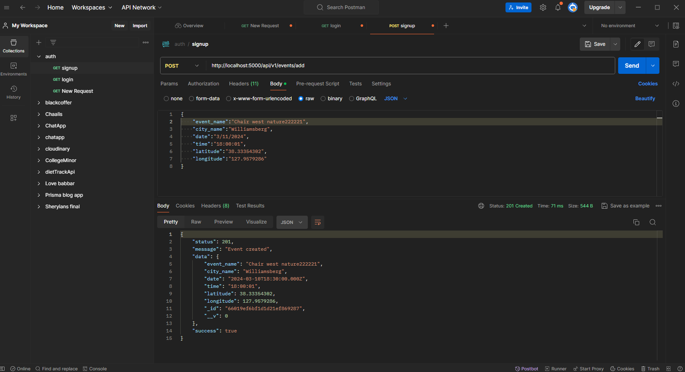
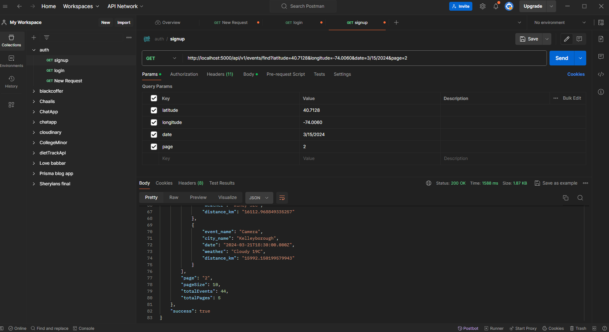
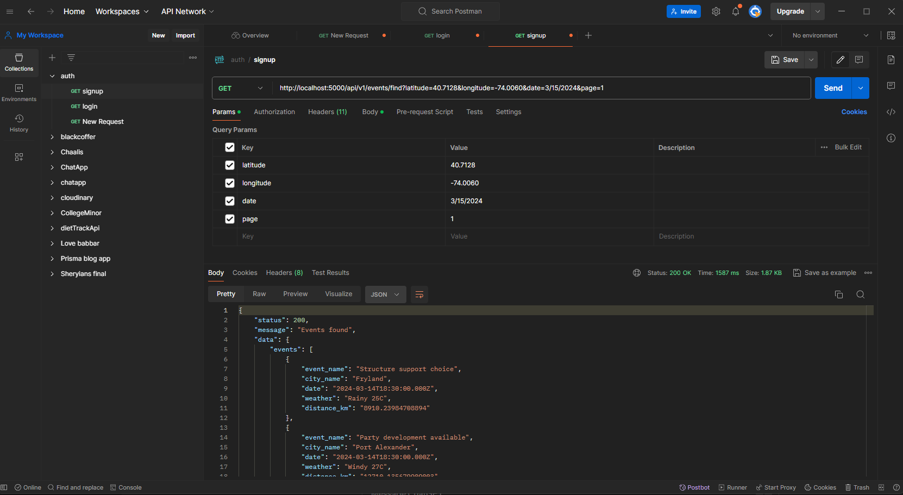

# Event Management API

This repository contains the source code for an Event Management API developed using Node.js and Express. The API allows users to create events and find events based on their location and specified date. External APIs are integrated to retrieve weather conditions and calculate distances for enhanced functionality.

# Tech Stack and Database

- Node.js: Event-driven, non-blocking I/O model for scalability.
- Express.js: Web application framework for building RESTful APIs.
- MongoDB: Flexible and scalable NoSQL database for storing event data.

# Design Decisions and Challenges

- REST API Design: Followed RESTful principles for intuitive interaction.
- Data Modeling: Designed schema for efficient storage and retrieval of event details.
- External API Integration: Integrated weather and distance calculation APIs for additional functionality.
- Pagination: Implemented pagination for improved performance and user experience.

# Setup and Running Instructions

1. Clone the repository to your local machine:

   ```
   git clone <repository-url>

   ```

2. Install dependencies using npm:

   ```
   npm install

   ```

3. Set up environment variables for API keys and database connection.
4. Run the application:

   ```
   npm run dev

   ```

# API Endpoints Documentation

1. POST /events/add

   - Request Format: JSON object containing event details (event name, city name, date, time, latitude, longitude)
   - Response Format: HTTP status code indicating success or failure

2. GET /events/find?latitude={latitude}&longitude={longitude}&date={date}

   - Request Format: Query parameters specifying user's latitude, longitude, and date
   - Response Format: JSON array containing event details sorted by earliest event after the specified date, including event name, city, date, weather, and distance

# Test Case Execution Screenshots





# Hosted URL

```
https://gyangrove.onrender.com

```

# Test Cases

```
curl -w "\n" "https://gyangrove.onrender.com/api/v1/events/find?latitude=40.7128&longitude=-74.0060&date=3/15/2024&page=1"

```
